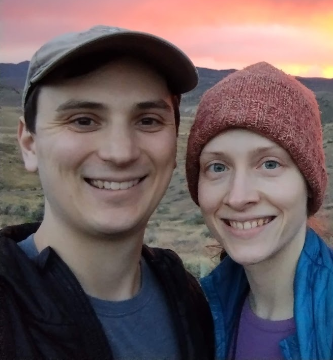
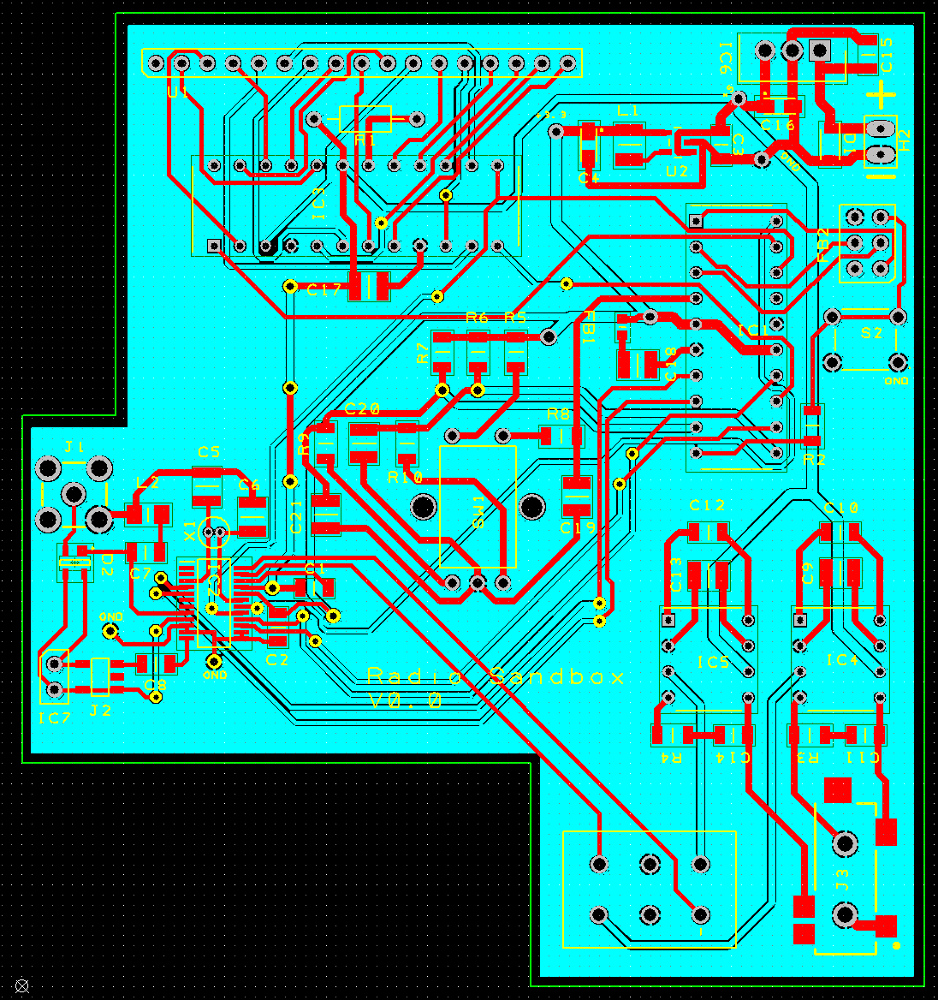

## Hi There! (I'm the one on the left)

Welcome! One way or another, you've stumbled upon my projects github.io page. Complete with mandatory "Look I've gone outside" software dev photograph.
My name is Dominic DeMarco, my education background is a BS in Computer Science, and I currently work in the industry as a software engineer.

In my free time I enjoy exploring anything technical that has struck my fancy. A lot of these projects you'll see are based around a loose
"accomplish X with Y" intent, it's the way I've found I best learn things... and it's fun, too!

I've organized my projects in reverse chronological order. I'll add and related links and provide a short description for your perusing pleasure.

These links will bring you to the associated headings to save your scroll wheel the trouble  
[Nebula Client](#nebula-client)
[FeO](#feo)  
[Video ESRGAN Superres](#video-esrgan-superres)  
[Radio Board](#radio-board)  
[Serial over LoRA](#serial-over-lora)  
[Python Racing Game Bot](#python-racing-game-bot)  
[Pascal-like Compiler](#pascal-like-compiler)  
[Sensor Movement Classification](#sensor-movement-classification)  

---

### Nebula Client
**Code:** [https://github.com/ddemarco5/nebula_client](https://github.com/ddemarco5/nebula_client)  
**Nebula:** [https://github.com/slackhq/nebula](https://github.com/slackhq/nebula)

Nebula is a very cool VPN project by the folks over at slack. It's a P2P encrypted UDP VPN that only needs a "lighthouse" server to connect
two peers together. NAT punchthrough is built in, it's performant, largely self contained, and easy to deploy.
However, when I was playing around with it I noticed that it's largely meant as a secure, direct, NAT bypassing means of client to client communication.
If you wanted to provide access a subnet on the same machine (like a more traditional VPN system) the use case seems to be intended for single devices or small sections of a subnet, not all traffic.

This project (written in rust) is a wrapper around the nebula executable to allow it to act like a vpn client on a windows machine. This means the routing table is backed up, cleared, and set up in a way so all traffic EXCEPT the peer target is routed through the wintun adapter created by nebula.
This is done by intercepting and parsing the stdout of nebula. When a message comes through that a peer has been connected, its IP address is pulled and added to the routing table to allow traffic to flow.
It will also clear the DNS server and set it to the nebula peer to ensure that 100% of traffic is transmitted through the nebula connection.

This project was an exploration into more advanced process control with rust, as well as to investigate the current state of direct windows API calls with rust.

---

### FeO

**Code:** [https://github.com/ddemarco5/FeO](https://github.com/ddemarco5/FeO)

I wanted to flex my rust muscles and play around with discord bot integration.
I wrote it to initially cross-post submissions from an arbitrary reddit user to a discord channel. (Think project updates or a friend)
Midway through development, fortuitously, youtube banned all the popular bots that were playing music in discord channels. I figured this was a perfect opportunity to write my own.
This project uses libraries written to interface with discord text channels and voice calls, and I wrote an easily expandable system for
advanced command processing.

Commands are listend for in a specified channel, parsed, and listeners are created for youtube url songs specified. The bot will then scan the discord
server's voice calls searching for the user who called it, join the call, and begin playing the audio stream that it transcodes to opus insitu.

---

### Video ESRGAN Superres

**Code:** [https://github.com/ddemarco5/VideoSuperRes](https://github.com/ddemarco5/VideoSuperRes)

Born of the idea of upscaling old animation and a want to learn the pytorch framework.
With some pointers and domain knowledge from a friend, this implementation of ESRGAN was written.
A custom video frame extractor was developed to make dropping in new files easy and to keep disk space down.
Results with it were promising, but free time and vram limitations have put it on pause.

---

### Radio Board

**Circuit Design and PCB:** [https://github.com/ddemarco5/design-pcb](https://github.com/ddemarco5/design-pcb)  
**Code:** [https://github.com/ddemarco5/RadioCode](https://github.com/ddemarco5/RadioCode)  
  
My first foray into circuit design and construction, and my current work in progress. The design was largely based around what parts I had gathered in my dragon's nest of electronics. Before this, the most advanced I had gotten was a little breadboard tinkering and Arduino work.
The general idea is to have a single board with 3 chips. A MAX7221 to drive the display, a SI4734-D60 to act as the radio, and an ATTINY861 to control the other 2. There's a rotary encoder to enable control, and a 3.5mm jack to allow for audio output.

A couple goals motivated this project. I wanted to:
1. Experiment with circuit design software and processes.
2. Practice soldering SMD (There's a .6mm pitch on one of those chips)
3. Try AVR programming from scratch. No arduino libs.
4. Get more experience with on-chip communication protocols. SPI, I2C, etc.
5. Practice hardware debugging. I got more practice than I would've liked...
6. Polish up my C++ by writing necessary code from scratch 
7. Program in a memory constrained environment (8k program storage, 512 bytes SRAM)
8. Watch a cool old red bubble LED display live again

If I were to do it again I would've spend more time in the prototyping stage (but I'm limited by tools and space), as the first revision had some design errors in some of the more complex things I attempted (hardware debouncing with RC filter circuits, etc). I ended up having to frankenstein a portion of the traces and rework the design into something functional without having to rebuild the entire board.

As far as programming goes, at the time of writing, I am properly driving the MAX7221 via a software SPI implementation. I'm currently trying to get the (much more complicated) radio chip to respond.  

---
  
### Serial over LoRA

   

**Hackaday link:** [https://hackaday.io/project/25677-chirppp-serial-over-lora](https://hackaday.io/project/25677-chirppp-serial-over-lora)  
**Radio Driver:** [https://github.com/ddemarco5/lora_driver](https://github.com/ddemarco5/lora_driver)  
**Serial Emulator:** [https://github.com/ddemarco5/chirppp](https://github.com/ddemarco5/chirppp)  
  
To date this is one of my favorite projects. The idea was to leverage posix standards to communicate and drive a pair of LoRA radio modules and expose a functional serial device to an end user of the system.

The things I wanted to accomplish in this project were:
1. Learn and practice the Rust programming language
2. Use a hobbyist site (hackaday) to log and reflect on progress made
3. Practice UNIX environment programming by using sysfs and pty (pseudoterminal) syscalls
4. Get more practice with cross compilation (ARMv6, ARMv7, MIPSEL)
5. Develop an executable for OpenWRT

This was a really fun project to work on, it touched on a lot of diverse areas so it hardly ever got stale.\

I got to learn the modern systems programming language [Rust](https://www.rust-lang.org/en-US/)! I highly recommend trying it out if you ever get the chance. 

I learned about the entire (and surprisingly outdated) tty system in the typical unix stack, and about how sysfs works.

In the end, I was able to reliably use sysfs to communicate with and drive the LoRA modules on each of the platforms I compiled the program for. After I was sending packets back and forth, I was able to create a psuedoterminal pair that piped its input into the portion of the program that emulated a full duplex serial connection (the radios are packet based and there is no receving while transmitting!). In the end what this accomplished was a software device, typically /dev/pty0 or something of the sort, that a user could write to or read from. All traffic would appear on the pseudoterminal of the other computer, acting as if the two were connected via a wire.

Once I had serial communication between the two devices, I was able to use the old point to point protocol to send TCP/IP traffic between the two devices. 

I had achieved a rudimentary wifi that at best could achieve a several kilometer range! Woohoo!  ... at least in theory. 

In practice though, the radio devices at max speed had barely enough bandwidth to maintain a tcp/ip connection, let alone a usable one. It was also hampered by the fact the the (admittedly cheap) radio modules I bought suffer from frequent false positives when receiving packets. I might revisit this project to try and further debug the problem, or at the very least work around it.  

---
  
### Python Racing Game Bot

**Code:** [https://github.com/ddemarco5/Redline](https://github.com/ddemarco5/Redline)  

A simple project I decided to write when a drag racing game I was playing at the time got a little too repetitive.

This is a much smaller project than some of the others. The idea behind this one was to use python to try and interface with WinAPI to find the game's window and its dimensions, emulate keypresses, and capture image data from the screen.

The actual logic behind the bot's decisions were simple pixel triggers, the focus was more on getting some experience with the WinAPI.  

---
  
### Pascal-like Compiler

**Code:** [https://github.com/ddemarco5/pascal_compiler](https://github.com/ddemarco5/pascal_compiler)  

One of the last projects done in my college career.

Written in C, we had to create a compiler for a Pascal-like language that was defined in class.
We used lex and yacc to generate the lexiacal analyzer and parser, but codegen was up to us.
I unfortunately had to stop working on the project before codegen was 100% completed. It didn't construct proper loops, but it worked for simple calculator-esque evaluation and assignment statements.  

---
  
### Sensor Movement Classification
**Code:** [https://github.com/ddemarco5/SensorMovementClassification](https://github.com/ddemarco5/SensorMovementClassification)  

An android application written for an independent study done in college.
The app allowed a user to train on movement and later recognize those movements. The intention was to use it in a larger project where software would be able to recognize what its user was doing. Standing, sitting, running, etc.
